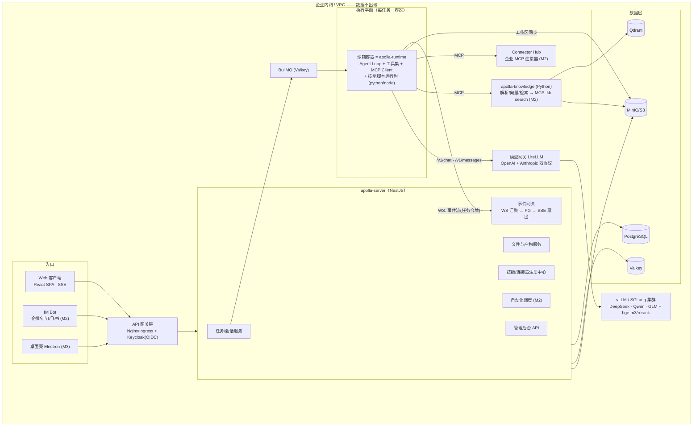
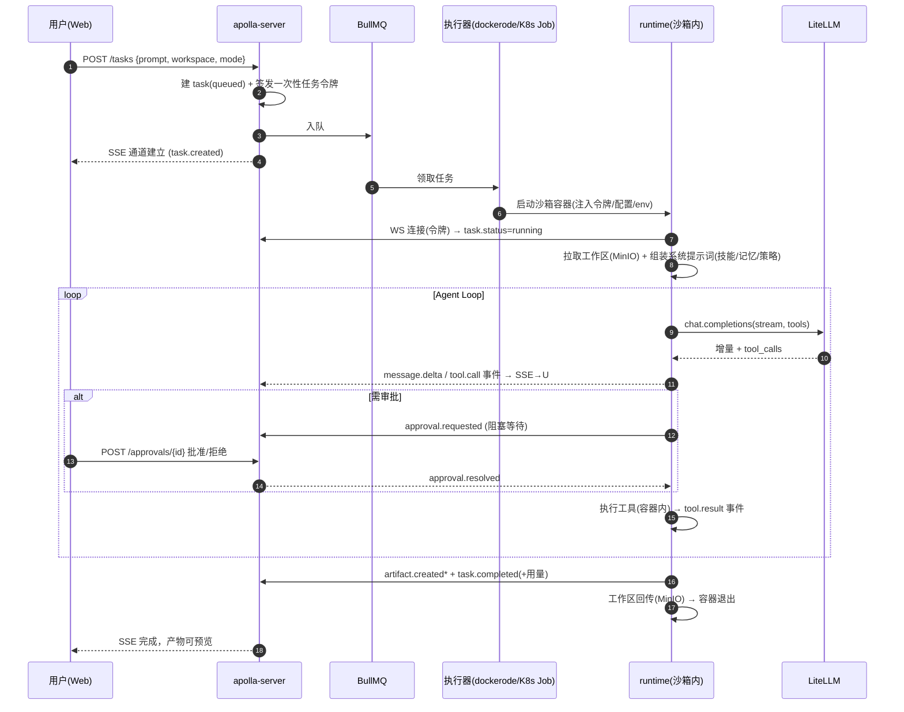

# Apolla Work — 产品需求与开发计划（PRD）

| | |
|---|---|
| **产品名** | Apolla Work（企业级 AI 智能体工作台，代号 ApollaCowork） |
| **版本** | v1.0 · 定稿可开工 |
| **日期** | 2026-08-28 |
| **定位一句话** | 对标腾讯 WorkBuddy 的全场景职场 AI 智能体平台，但面向企业：**Web 优先、服务端沙箱执行、全链路私有化部署、数据不出域**。 |
| **依据** | 《WorkBuddy 技术拆解报告》（对 WorkBuddy v5.3.14 的实测拆包 + 公开资料） |
| **读者** | 开发团队 + Claude Code（本文档是工程实现的单一事实来源） |

---

## 0. 本文档如何使用（写给 Claude Code）

本文档是 Apolla Work 的**单一事实来源（SSOT）**。任何开发会话应遵循：

1. 先读根目录 `CLAUDE.md`（工程规范与当前阶段），再读本文档相关章节。
2. 开发任务从 **§7 里程碑与任务分解** 中按顺序领取（`T-xxx`），不跳里程碑；每个任务有明确的 DoD（完成定义），完成后把对应复选框勾上并提交。
3. 接口与事件的**类型定义以 `packages/protocol` 为准**，本文档 §4.7/§4.8 与附录 A/B 是其规格说明；两者不一致时，修正代码使其符合本文档，或在本文档中记录变更（附 ADR 简注）。
4. 技术选型以 **§5** 为准。不得引入 §5 之外的重量级依赖（框架、数据库、消息队列等）；小工具库可自行决定。
5. 合规红线：不复制任何竞品（WorkBuddy/CodeBuddy）的代码、提示词与素材；兼容其开放格式约定（SKILL.md、MCP、ACP）是允许且推荐的。
6. 未尽事宜按「先跑通、可替换、留接缝」原则决策，并在 `docs/adr/` 追加一条 ADR。

---

## 1. 产品概述

### 1.1 背景与机会

WorkBuddy（腾讯）验证了「任务式 Agent 工作台」的产品形态：用户用自然语言下达任务，Agent 自主规划、调用工具、产出文档/表格/PPT/网页等交付物。但它是公有云 SaaS + 员工个人电脑执行，企业客户面临三个障碍：**数据出域、无法治理（审计/权限/配额）、无法接入私有模型与内网系统**。

Apolla Work 的机会：把同等的 Agent 能力做成**可私有化交付的企业平台**——服务端沙箱执行、统一审计、SSO/RBAC、私有模型、内网连接器。

### 1.2 目标用户

| 角色 | 描述 | 核心诉求 |
|---|---|---|
| 业务员工（主用户） | 财务/运营/市场/研究等知识工作者 | 用一句话完成报告、表格、PPT、数据分析；过程可控、结果可用 |
| 部门管理者 | 团队负责人 | 沉淀团队技能与模板；自动化例行工作（周报、日报、监控） |
| IT 管理员 | 平台运维与安全 | 私有化部署简单；模型/成员/权限/配额可管；全量审计 |
| 技能开发者 | 企业内 IT 或集成商 | 用开放格式（SKILL.md/MCP）扩展能力，无需改平台代码 |

### 1.3 核心场景（V1 黄金场景，也是验收评测集）

1. 上传财报 PDF → 生成经营分析报告（docx）+ 关键指标表（xlsx）
2. 上传原始 CSV → 数据清洗 → 可视化图表 + 结论摘要
3. 给定主题与素材 → 生成结构化 PPT（pptx）
4. 合同/标书 PDF → 要点抽取与风险清单
5. 资料库问答：基于企业知识库回答并给出引用出处
6. 多文件汇总：把一个目录的周报汇总成月度综述
7. 网页调研（可选联网）→ 竞品/行业 brief
8. 定时自动化：每天 9:00 生成数据日报并推送到企业微信群
9. IM 指令：在企微里 @机器人 下达任务，结果回推
10. 长任务纠偏：执行中用户补充指令/驳回审批，Agent 正确调整

### 1.4 与 WorkBuddy 的对标矩阵

| WorkBuddy 能力 | 它的实现（拆包结论） | Apolla Work 对策 | 版本 |
|---|---|---|---|
| 任务（Agent 执行）| 桌面本地执行，Electron 内嵌 CodeBuddy CLI，ACP 通信 | 服务端沙箱容器执行，Web 实时呈现过程 | M1 |
| 交互模式 ask/plan/craft | 插件化 interactionmode + 工具策略 | 权限模式 ask/plan/auto + 组织级工具策略 | M1 |
| 技能 Skills | SKILL.md（Claude Code 同构）| 完全兼容 SKILL.md 约定，可复用开源技能 | M1 |
| 连接器 | MCP + 本地聚合代理 | MCP + 服务端连接器中心（Connector Hub）| M1 |
| 专家 | 插件内 agents 定义 | 专家 = 子代理模板（提示词+工具白名单+技能集）| M2 |
| 资料库 | 端云混合 | 服务端 RAG（解析/向量/引用溯源），以内置 MCP 连接器形态接入 | M2 |
| 自动化 | 本地定时任务 | 服务端 cron/触发器 + 运行历史 + 结果推送 | M2 |
| 微信/IM 遥控 | 客户端直连微信 + Centrifugo 云通道 | 服务端 Bot：企业微信/钉钉/飞书（不做个人微信）| M2 |
| 多模型 Auto 路由 | 云网关（混元/DeepSeek）| LiteLLM 网关 + 规则路由，模型企业自选 | M0 |
| Office 产物 | 腾讯文档引擎 + 专用插件 | 开源路线：python-docx/openpyxl/pptx 技能 + 模板库 + LibreOffice 预览 | M1 |
| 沙箱 | Seatbelt/本机 + safe-bin 垫片 | Docker(+gVisor) 容器级隔离 + 出网白名单 | M1/M2 |
| 桌面客户端 | Electron | 后置：Electron 壳复用同一协议（本地执行模式）| M3 |
| 技能市场 | 云端 marketplace | 企业内市场（上架/签名/审核）| M3 |

**差异化主张（销售话术级）**：① 全链路私有化，含模型；② 企业治理三件套（SSO/RBAC/全量审计）开箱即用；③ 开放格式（SKILL.md/MCP），不锁定；④ 交付即评测（golden set 跑分报告随部署输出）。

### 1.5 非目标（V1 明确不做）

- 桌面客户端与本地文件直接操作（M3）
- 个人微信集成（合规风险，永不做；企业 IM 走官方 Bot API）
- 代码开发 IDE 场景（CodeBuddy 的主场，不与其正面竞争；保留 Bash/代码执行能力即可）
- 移动端 App（IM 通道覆盖移动场景）
- 模型训练平台（只做接入与评测，不做训练）

### 1.6 成功指标

| 指标 | M1（MVP）| M2（企业化）|
|---|---|---|
| 黄金场景完成率（10 项自动评测）| ≥ 70% | ≥ 85% |
| 任务首个流式响应 | < 3s | < 2s |
| 单执行节点并发任务 | ≥ 20 | ≥ 50 |
| 私有化部署时长（单机）| < 60 min | < 30 min（离线包）|
| 种子用户周活留存 | 10 人内测可用 | 首个付费 POC 上线 |

---

## 2. 功能需求

> 编号规则：F1–F12 为功能域；每条含验收标准（AC）。标注 [M0/M1/M2/M3] 为交付里程碑。

### F1 账户、组织与权限 [M1]

- 单租户起步（一套部署服务一家企业），所有表带 `org_id` 预留多租户（M2 可选开启）。
- SSO：OIDC 对接（默认部署 Keycloak，可对接企业既有 IdP/LDAP）；JIT 建户。
- 角色：`admin`（平台管理）、`member`（使用者）；workspace 级 `owner/editor/viewer`。
- **AC**：OIDC 登录换取会话；未授权访问一律 401/403；角色变更即时生效；所有登录与授权变更进审计。

### F2 工作空间（Workspace）[M1]

对标 WorkBuddy 的「项目/空间」：任务的容器与隔离边界。

- 每个 workspace 有独立文件区（MinIO 前缀）、成员与默认权限模式、可用技能/连接器配置。
- **AC**：跨 workspace 文件不可互访；成员管理生效；删除 workspace 走软删除并保留审计。

### F3 任务与会话 [M1] —— 产品核心

- 会话（session）内可发起多轮任务（task/run）；一次任务 = 一次 Agent 执行（一个沙箱容器生命周期）。
- 输入框支持：`@` 引用工作区文件、`/` 调用技能、选择权限模式与模型档位（默认 Auto）。
- 过程可视化（流式）：计划（todo list）、工具调用卡片（含 Bash 命令与输出、文件 diff）、Agent 消息、产物卡片、token 用量。
- 任务控制：暂停/继续追加指令（steering）、取消、失败重试；任务列表与历史回放（事件溯源）。
- **AC**：黄金场景 1–6 端到端可跑；中途追加指令能改变后续行为；断网重连后 SSE 从断点续传（Last-Event-ID）；历史任务可完整回放。

### F4 审批与权限模式 [M1]

- 三种模式：`ask`（写操作与危险命令逐项审批）、`plan`（先产出计划，确认后执行）、`auto`（白名单内自动，越界仍审批）。
- 审批对象：Bash 危险命令（规则表）、文件删除/覆盖、连接器写操作、出网请求（域外）。
- 组织级策略：admin 可锁定某些工具全局禁用或强制审批（如 WebFetch 仅白名单域）。
- **AC**：审批请求实时到达前端并可批准/拒绝/全部允许（本任务内）；拒绝后 Agent 继续以替代方案推进或明确报告受阻；策略变更无需重启生效。

### F5 工作区文件与产物 [M1]

- 上传（拖拽/多文件/文件夹）、目录树、下载、版本（产物按任务归档）。
- 预览：PDF/图片/HTML/Markdown/CSV 原生预览；docx/xlsx/pptx 服务端转 PDF 预览（沙箱内 LibreOffice），原文件可下载。
- 产物（artifact）：Agent 声明的交付物在任务面板突出展示。
- **AC**：500MB 单文件上传稳定；office 转 PDF 预览 P95 < 10s；产物卡片可预览可下载。

### F6 技能系统 [M1]

- 完全兼容 Claude Code 的 SKILL.md 约定（见附录 C）：frontmatter（name/description）+ 正文指令 + `scripts/`、`references/`、`assets/`。
- 加载策略（渐进披露）：系统提示词只注入技能名+描述；Agent 调用 `Skill` 工具时才加载全文。
- 内置技能 V1（见附录 D）：docx 报告、xlsx 分析、pptx 生成、pdf 处理、数据可视化、财报分析。
- 技能管理：平台内置 + workspace 自定义上传（zip）；admin 可禁用。
- **AC**：新增技能不改平台代码；黄金场景中技能被正确触发；技能脚本在沙箱内执行成功。

### F7 连接器（MCP）[M1 客户端 / M2 中心]

- Runtime 内置 MCP 客户端（stdio + Streamable HTTP）。
- Connector Hub（服务端）：统一注册企业连接器（内网 API、数据库、OA…），按 workspace 授权，凭据加密存储（KMS/信封加密），调用全审计。
- **AC**：接入一个示例连接器（如内网 REST API 的 MCP 包装）跑通黄金场景；凭据不落明文；连接器调用出现在审计与过程卡片中。

### F8 资料库（RAG）[M2]

- 知识库 CRUD、文档批量导入（pdf/docx/pptx/xlsx/md/html）、解析进度、失败重试。
- 检索：混合（向量+全文）+ 重排；回答强制带引用（文档+页码/段落定位）。
- 对 Agent 暴露为内置 MCP 连接器 `kb-search`（资料库即工具，架构上零特殊分支）。
- **AC**：千页级 PDF 库问答 P95 < 6s；引用可点击定位原文；黄金场景 5 通过。

### F9 自动化 [M2]

- 定时任务（cron 表达式 + 时区）与事件触发（webhook）；任务模板 = 固化的 prompt + workspace + 技能/模式配置。
- 运行历史、失败告警、结果推送（站内 + IM 通道）。
- **AC**：黄金场景 8 通过；错过调度（停机）有补偿策略（跳过并记录，不补跑，可配）。

### F10 IM 通道 [M2]

- 企业微信、钉钉、飞书官方 Bot：在群/单聊中 @机器人下达任务；进度关键节点与最终产物（文件/链接）回推；审批可在 IM 内点按钮完成。
- **AC**：黄金场景 9 通过；IM 消息与平台任务一一关联可追溯。

### F11 管理后台 [M0 雏形 / M2 完整]

- 模型管理：接入（OpenAI 兼容端点/密钥）、路由规则（任务类型→模型）、限流限额、连通性测试。
- 成员与策略：成员/角色、工具策略、连接器授权。
- 观测看板：任务量/成功率/时延/token 消耗（按用户/工作空间/模型分维度）；审计检索与导出（jsonl/csv）。
- **AC**：换模型不重启；配额超限有明确拦截与提示；审计可按人/时间/事件类型检索。

### F12 部署与运维 [M1 单机 / M2 集群]

- 单机：`docker compose` 一键部署 + 安装向导脚本（探测 GPU、生成配置、拉起、自检）。
- 集群：Helm chart（K8s），执行器用 K8s Job；离线安装包（全镜像 tar + 制品）。
- 自检页：各组件健康、模型连通、评测冒烟。
- **AC**：满足 §1.6 部署时长指标；升级有版本迁移脚本；全组件日志与指标接入 OTel。

---

## 3. 非功能需求（NFR）

| 类别 | 要求 |
|---|---|
| 私有化 | 全组件可离线运行；无任何强制外呼（遥测默认关闭，开启需显式配置指向企业自建收集器） |
| 安全 | 沙箱逃逸防护（容器 + 可选 gVisor）；出网默认拒绝、白名单放行；提示注入基础防护（工具结果标记为数据、外部内容不作为指令）；密钥信封加密；OWASP ASVS L2 对齐 |
| 审计 | 所有工具调用、审批、admin 操作、登录留痕；审计流不可由业务角色删除 |
| 性能 | 见 §1.6；事件通道端到端延迟 P95 < 500ms |
| 可用性 | 单机版组件自动重启恢复；集群版无单点（除数据库主从）|
| 兼容 | 服务器 x86_64 为主；信创（ARM/昇腾）为 M3 商机驱动项 |
| 国际化 | UI 中文优先，i18n 框架就位（文案 key 化）|
| 许可合规 | 依赖清单许可审查（见 §5.4）；分发物不含 GPL 传染项 |

---

## 4. 系统架构

### 4.1 总体架构



**要点**（与 WorkBuddy 的关键差异）：执行从员工电脑移到服务端**每任务一沙箱容器**；Runtime 进程直接跑在沙箱内（工具执行天然被隔离，无需二次沙箱）；模型、知识、连接器全部收敛在内网。

### 4.2 组件清单

| 组件 | 目录 | 语言/框架 | 职责 |
|---|---|---|---|
| apolla-web | `apps/web` | React 19 + Vite | 全部前端 UI |
| apolla-server | `apps/server` | NestJS 11 | REST API、事件网关、任务编排、审批、注册中心、admin |
| apolla-runtime | `apps/runtime` | Node 22 + TS（无框架）| Agent Loop、工具集、技能加载、MCP 客户端；打包进沙箱镜像 |
| sandbox-image | `infra/sandbox` | Dockerfile | ubuntu24 + node22 + python3.12(uv) + LibreOffice + 中文字体 + 常用库 |
| apolla-knowledge | `apps/knowledge` | Python 3.12 + FastAPI | 文档解析、向量化、混合检索，暴露 REST + MCP（M2）|
| apolla-im | `apps/im-bridge` | Node + TS | 企微/钉钉/飞书 Bot 桥（M2）|
| protocol | `packages/protocol` | TS + zod | 事件、API DTO、工具 schema 的单一类型来源 |
| agent-tools | `packages/agent-tools` | TS | 工具实现（runtime 引用）|
| skills | `skills/` | Markdown+脚本 | 内置技能（SKILL.md 规范）|
| infra | `infra/` | compose/Helm | 部署、LiteLLM 配置、Keycloak realm、OTel |

### 4.3 任务执行流（核心时序）



用户中途追加指令：`POST /tasks/{id}/input` → server 经 WS 下发 → runtime 在下一轮 loop 前注入为用户消息（steering）。

### 4.4 Agent Runtime 设计（apolla-runtime）

自研 Loop（约 2–3k 行核心代码），不依赖重型 Agent 框架（拆解证明腾讯路线 = 轻 SDK + 自研运行时；我们进一步收敛为纯自研，保留将来换底的接缝）。

- **模型接口**：OpenAI Chat Completions（经 LiteLLM），function calling + streaming；预留 Anthropic Messages 适配器。
- **系统提示词组装**（模板在 `apps/runtime/prompts/`，TS 模板函数而非运行时模板引擎）：身份与边界 → 权限模式说明 → 工作区上下文（文件清单摘要）→ 可用技能目录（仅名称+描述）→ 组织策略 → 输出规范。支持 `system-reminder` 机制（策略变更/审批结果以系统提醒注入）。
- **工具注册**：zod schema 定义（`packages/protocol`），运行时导出 JSON Schema 给模型；工具执行统一经过：权限检查 → 审批（如需）→ 执行 → 结果截断（大输出落盘引用）→ 审计事件。
- **上下文管理**：token 计量；超阈值（模型上限 70%）触发压缩——保留系统提示词+计划+最近轮次，中段摘要化；长任务用 `PLAN.md`/todo externalize 状态（对标 WorkBuddy 的 plans/）。
- **子代理（M2）**：`Agent` 工具派生子任务（同容器内新 loop，独立上下文，结果回注）；「专家」= 存库的子代理模板（提示词+工具白名单+技能集）。
- **失败与恢复**：模型调用指数退避重试；工具异常回传给模型自纠；容器崩溃 → task.failed（事件溯源保证可回放已发生部分）。

**V1 工具集**（详细规格见附录 A）：`Read` `Write` `Edit` `Glob` `Grep` `Bash` `TodoWrite` `Skill` `AskUserQuestion` `WebFetch` `WebSearch` `McpCall`（动态）`Artifact` `Agent`(M2)。

### 4.5 沙箱设计

| 项 | V1（M1）| 加固（M2）|
|---|---|---|
| 隔离 | 每任务一容器（runc），非 root 用户，read-only rootfs + 可写 `/workspace` `/tmp` | gVisor(runsc) RuntimeClass 可选；seccomp/AppArmor profile |
| 资源 | CPU 2c / 内存 4G / 磁盘 10G 默认，admin 可调 | cgroup 细化 + 任务级计量计费 |
| 网络 | 默认仅放行：LiteLLM、server(WS)、MinIO、Connector Hub、knowledge | 出网白名单代理（企业可配外网域名单）|
| 镜像 | ubuntu24 + node22 + python3.12(uv 预装 pandas/openpyxl/python-docx/python-pptx/matplotlib 等) + LibreOffice + Noto CJK 字体 + ripgrep | 分层瘦身、按技能集裁剪 |
| 生命周期 | 启动 < 2s（镜像预拉 + 容器池预热，对标 WorkBuddy prewarm）| 池化调度器独立化 |
| 工作区 | 启动时从 MinIO 拉取（按需/清单），结束回传增量 | 大文件流式与断点 |

### 4.6 数据模型（PostgreSQL，Prisma 管理）

核心表（字段列关键项，详见 `apps/server/prisma/schema.prisma`）：

| 表 | 关键字段 | 说明 |
|---|---|---|
| orgs / users / memberships | role(admin,member), sso_subject | F1 |
| workspaces / workspace_members | org_id, default_mode, role | F2 |
| sessions | workspace_id, title | 会话 |
| tasks | session_id, status(queued,running,waiting_approval,completed,failed,cancelled), mode, model_route, prompt, usage_json, sandbox_id | 一次执行 |
| task_events | task_id, seq(单调), type, payload(jsonb), ts | **事件溯源主表**，SSE 与回放的来源 |
| approvals | task_id, kind, payload, status, resolver_id | F4 |
| artifacts | task_id, path, mime, size, preview_status | F5 |
| files | workspace_id, path, size, version, uploader | 工作区文件索引（内容在 MinIO）|
| skills | scope(builtin,workspace), name, version, enabled, manifest | F6 |
| connectors | org_id, kind(stdio,http), config_enc, scopes | F7 |
| kb_bases / kb_documents / kb_chunks_meta | 解析状态、页码定位（向量在 Qdrant）| F8 |
| automations / automation_runs | cron, tz, template, last_status | F9 |
| im_bindings | channel(wecom,dingtalk,feishu), external_id | F10 |
| model_providers / model_routes | endpoint, key_enc, rule(task_kind→model) | F11 |
| audit_events | actor, action, target, detail, ip | 只增不删 |
| usage_records | task_id, model, in_tokens, out_tokens, cost | 配额与看板 |

### 4.7 API 概要（REST，前缀 `/api/v1`，OpenAPI 由 NestJS 生成）

| 域 | 端点（节选）|
|---|---|
| auth | `GET /me` |
| workspaces | `POST/GET/PATCH/DELETE /workspaces`, `/workspaces/{id}/members` |
| sessions | `POST/GET /workspaces/{id}/sessions` |
| tasks | `POST /sessions/{id}/tasks`、`GET /tasks/{id}`、`POST /tasks/{id}/cancel`、`POST /tasks/{id}/input`（追加指令）、`GET /tasks/{id}/events`（**SSE**，支持 Last-Event-ID 重放）|
| approvals | `POST /approvals/{id}`（approve/deny，可 scope=task）|
| files | `POST /workspaces/{id}/files`（分片）、`GET .../files?path=`、`GET /files/{id}/download`、`GET /files/{id}/preview` |
| skills | `GET /skills`、`POST /workspaces/{id}/skills`（zip）、`PATCH /skills/{id}` |
| connectors | `POST/GET/PATCH /connectors`、`POST /connectors/{id}/test` |
| kb (M2) | `POST /kb/bases`、`POST /kb/bases/{id}/documents`、`POST /kb/search` |
| automations (M2) | CRUD + `GET /automations/{id}/runs` |
| admin | `/admin/models`、`/admin/routes`、`/admin/policies`、`/admin/usage`、`/admin/audit` |
| internal | `WS /internal/runtime`（任务令牌鉴权，runtime 专用）|

### 4.8 事件协议（SSE 与 task_events 共用，类型见附录 B）

设计规则：**事件是唯一真相**——前端渲染、历史回放、审计视图、IM 推送全部从同一事件流派生；事件 payload 由 `packages/protocol` 的 zod schema 约束并版本化（`v` 字段）。

### 4.9 安全设计要点

- 任务令牌：一次性、绑定 task_id、短时效；runtime 只能上报自己任务的事件。
- 提示注入防护：工具结果/网页内容/文件内容在提示词中一律以「数据」框定（分隔符 + 来源标注 + 指令免疫提示）；连接器返回不作为指令执行；高危动作（出网、批量删除）不受内容驱动，必须模式/审批允许。
- 凭据：连接器与模型密钥信封加密（主密钥来自部署环境 KMS/文件），审计不落敏感值。
- 供应链：镜像固定 digest；SBOM 随离线包交付。

---

## 5. 技术栈定稿

### 5.1 语言与运行时

| 项 | 选型 | 理由 |
|---|---|---|
| 主语言 | TypeScript 5.9（前端/服务端/runtime 同栈）| 类型共享（protocol 包），团队与 Claude Code 开发效率最高；拆解显示腾讯同为 TS 全栈 |
| 辅语言 | Python 3.12（knowledge 服务 + 技能脚本）| 文档解析/RAG/数据分析生态 |
| Node | ≥ 22 LTS（建议 24）| |
| 包管理 | pnpm 10 + turborepo | monorepo 标配 |

### 5.2 组件选型

| 层 | 选型（版本基线）| 备选 | 说明 |
|---|---|---|---|
| 前端 | React 19 + Vite 7 + TanStack Query 5 + zustand 5 + Tailwind 4 + shadcn/ui + ECharts 6 + xterm.js + shiki + pdf.js | Vue3 | ECharts 国产、图表场景强 |
| 服务端 | NestJS 11（Fastify 适配器）+ Prisma 6 | Fastify 裸奔 | DI/Guard/Interceptor 天然适配 SSO/RBAC/审计横切 |
| 队列/调度 | BullMQ 5（Valkey 后端）| Temporal | Temporal 对 V1 过重；接缝留在 QueuePort 接口 |
| 缓存/KV | **Valkey 8**（Redis 兼容，BSD）| Redis | 规避 Redis 新许可对商用分发的不确定性 |
| 数据库 | PostgreSQL 16/17 | — | |
| 对象存储 | MinIO（独立进程部署）| SeaweedFS(Apache-2) | MinIO 为 AGPL：仅以独立服务方式使用不修改源码，法务过一遍；敏感客户换 SeaweedFS |
| 向量库 | Qdrant 1.x | Milvus | 轻、运维简单；超大规模再上 Milvus |
| 模型网关 | LiteLLM（proxy 模式）| OneAPI/new-api | 同时暴露 `/v1/chat/completions` 与 `/v1/messages`，为接入 Claude 系生态留口 |
| 推理 | vLLM ≥0.10 / SGLang | MindIE（昇腾）| |
| 默认模型建议 | 旗舰档 DeepSeek-V3.x（MIT）/ Qwen3-235B-A22B（Apache-2）；标准档 Qwen3-32B；嵌入 bge-m3；重排 bge-reranker-v2-m3 | GLM-4.x | M0 用评测定档，Agent 能力（工具调用）为第一权重 |
| 文档解析 | Docling（MIT）| MinerU（AGPL，需合规评估）| |
| Office 生成 | python-docx / openpyxl / python-pptx（技能脚本内）+ 模板库 | — | 与开源技能生态同路线 |
| Office 预览 | 沙箱内 LibreOffice → PDF | OnlyOffice | 后者部署重，M3 再评 |
| 容器执行 | dockerode（V1 单机/多机）→ K8s Job（M2）| — | 执行器抽象 ExecutorPort |
| 沙箱加固 | gVisor（M2 可选开启）| Kata | |
| 身份 | Keycloak 26 | Casdoor | 企业 IdP 对接生态最全 |
| 可观测 | OpenTelemetry + Langfuse v3（自托管）+ Grafana/Loki/Prom（可选套件）| — | 任务回放另有事件溯源，Langfuse 管 LLM 链路 |
| IM SDK | 企微回调/企微机器人、dingtalk-stream、@larksuiteoapi/node-sdk | — | 与 WorkBuddy 同款官方 SDK 路线 |
| 搜索（可选联网）| SearxNG 自托管 + WebFetch 域白名单 | Bing API | 纯内网部署可整体关闭 |

### 5.3 刻意不引入

- 重型 Agent 框架（LangChain/LlamaIndex/AgentScope 等）：Loop 是产品命脉，自研可控；生态件按工具粒度引。
- 微服务网格/Service Mesh：组件数有限，compose/Helm 足够。
- 自建消息总线（Kafka）：事件量级 PG + SSE 足以支撑到 M3 之后。

### 5.4 许可合规基线

MIT/Apache-2/BSD 为主；AGPL 组件（MinIO、MinerU 若启用）仅以独立进程方式使用、不修改分发，交付前法务复核；禁止 GPL 代码进入自研包。交付物附 SBOM。

---

## 6. 仓库结构与工程规范

```
ApollaCowork/
├── CLAUDE.md                  # 工程规范 + 当前阶段（Claude Code 首读）
├── docs/
│   ├── PRD.md                 # 本文档（SSOT）
│   └── adr/                   # 架构决策记录（ADR-001-xxx.md）
├── apps/
│   ├── web/                   # React SPA
│   ├── server/                # NestJS（含 prisma/）
│   ├── runtime/               # Agent 运行时（打包进沙箱镜像）
│   ├── knowledge/             # Python FastAPI（M2）
│   └── im-bridge/             # IM 桥（M2）
├── packages/
│   ├── protocol/              # zod：事件/DTO/工具 schema（唯一类型来源）
│   └── agent-tools/           # 工具实现
├── skills/                    # 内置技能（每个一目录，SKILL.md 规范）
├── infra/
│   ├── compose/               # compose.dev.yml / compose.prod.yml
│   ├── sandbox/               # 沙箱镜像 Dockerfile
│   ├── litellm/               # 网关与路由配置
│   ├── keycloak/              # realm 导出
│   └── helm/                  # M2
└── eval/                      # 黄金场景评测（任务定义 + 跑分脚本）
```

**规范要点**：TS `strict`；ESLint+Prettier 统一；vitest 单测（server 仓储层与 runtime 工具层必测）；conventional commits；每个 `T-xxx` 一个分支/一次 PR；事件与 DTO 改动必须同步 `packages/protocol` 并升 `v`；禁止在代码中写死模型名（一律走路由配置）。

---

## 7. 里程碑与任务分解

> 团队基线 6–8 人（1 架构 / 2 runtime / 2 平台后端 / 1–2 前端 / 1 模型&RAG）。
> 任务格式：编号、涉及目录、说明、**DoD**。按序执行，依赖已按顺序排好。

### M0 · 骨架与技术验证（第 1–3 周）—— 目标：证明「模型 + Loop + 沙箱」成立

- [x] **T-001 Monorepo 初始化**（根）
  pnpm workspaces + turborepo + tsconfig 基线 + ESLint/Prettier + vitest + CI（lint/test/build）。
  **DoD**：`pnpm i && pnpm build && pnpm test` 全绿。
- [~] **T-002 开发基础设施 compose**（infra/compose）
  PG16 / Valkey / MinIO / Qdrant / LiteLLM / Langfuse（可选 profile）。
  **DoD**：`docker compose -f compose.dev.yml up -d` 后自检脚本全通过。
- [x] **T-003 protocol 包 v0**（packages/protocol）
  任务状态机、事件类型（附录 B 全集）、工具 schema（附录 A 全集）的 zod 定义 + JSON Schema 导出。
  **DoD**：类型可被 server/runtime 引用；schema 快照测试。
- [x] **T-004 模型网关接通**（infra/litellm）
  LiteLLM 配置：≥2 个候选模型（本地 vLLM 或暂用外部 API 占位）+ `/v1/messages` 透传 + 路由规则样例。
  **DoD**：curl 冒烟通过；密钥不入库明文。
- [x] **T-005 Agent Loop v0**（apps/runtime）
  流式 chat + tool_calls 解析 + zod 工具注册表 + 中断/取消 + 模型重试；事件以 protocol 类型输出到 stdout（本阶段）。
  **DoD**：mock 工具下多轮循环单测通过；取消能即刻停。
- [x] **T-006 核心工具 v0**（packages/agent-tools）
  Read/Write/Edit/Glob/Grep/Bash（含 ripgrep 集成、输出截断、超时）。
  **DoD**：工具层单测 ≥ 30 例；大文件/二进制/超时边界覆盖。
- [x] **T-007 沙箱镜像 v0**（infra/sandbox）
  Dockerfile（§4.5 清单）+ 构建脚本；runtime 打包进镜像。
  **DoD**：镜像 < 4GB；容器内 python/node/libreoffice/字体自检脚本通过。
- [ ] **T-008 执行器 v0 + 工作区同步**（apps/server 内嵌或独立脚本）
  dockerode 启动沙箱、注入 env；MinIO 拉取/回传工作区。
  **DoD**：给定输入文件目录，容器内可见；产物回传可下载。
- [x] **T-009 CLI 试跑器**（apps/runtime/bin）
  `apolla-dev run "<prompt>" --workspace ./demo` 本地起容器跑完整任务，终端渲染事件流。
  **DoD**：黄金场景 1（财报→xlsx）端到端首次跑通（允许人肉起 compose）。
- [x] **T-010 黄金评测集 v0**（eval/）
  10 场景任务定义（输入文件+prompt+机器可判校验点）+ 跑分脚本（成功率/时长/token）。
  **DoD**：`pnpm eval` 出 markdown 报告。
- [x] **T-011 模型评测与定档**（eval/）
  ≥3 个候选模型跑黄金集，出对比报告。
  **DoD**：`docs/adr/ADR-001-model-selection.md` 定稿默认路由。
- [ ] **T-012 M0 演示与复盘**
  **DoD**：黄金场景 1/2/3 至少 2 个稳定通过；M1 范围确认。

### M1 · MVP（第 4–13 周）—— 目标：10 个种子用户日常可用，单机一键部署

**E1 服务端核心**
- [x] **T-101 数据库 Schema v1**（apps/server/prisma）：§4.6 全表 + 迁移 + 种子。**DoD**：migrate/seed 可重复执行；仓储层单测。
- [x] **T-102 任务服务与状态机**：创建/取消/追加指令；BullMQ 入队；执行器领取（ExecutorPort：dockerode 实现）；容器预热池（≥2 待命）。**DoD**：并发 20 任务稳定；容器泄漏为零（异常退出有回收）。
- [x] **T-103 事件网关**：runtime WS 接入（任务令牌鉴权）→ task_events 持久化（seq 单调）→ SSE 扇出（Last-Event-ID 重放）。**DoD**：断线重连不丢不重；回放接口=实时接口同构。
- [x] **T-104 文件与产物服务**：分片上传、目录树、下载签名 URL；office→PDF 预览转换队列（沙箱跑 LibreOffice）。**DoD**：F5 AC 全过。
- [x] **T-105 审批服务**：approval 生命周期 + 超时策略（默认 30min 挂起提醒）+ 「本任务内全部允许」。**DoD**：F4 AC 中服务端部分全过。

**E2 Runtime 增强**
- [x] **T-106 权限模式与审批等待**（apps/runtime）：ask/plan/auto 实现；危险命令规则表；审批阻塞与结果注入（system-reminder）。**DoD**：三模式行为差异有集成测试。
- [x] **T-107 上下文管理**：token 计量、阈值压缩、TodoWrite/PLAN 外化。**DoD**：构造 200k token 长任务不崩、不失忆（计划项不丢）。
- [x] **T-108 技能系统**：SKILL.md 加载器（附录 C 规范）+ Skill 工具（渐进披露）+ workspace 技能包安装。**DoD**：F6 AC 全过。
- [x] **T-109 MCP 客户端**：stdio + Streamable HTTP；连接器配置注入；工具动态注册（McpCall）。**DoD**：示例连接器全链路（含审计）通过。
- [x] **T-110 内置技能 6 件**（skills/）：附录 D 清单；每技能自带 1 条评测用例。**DoD**：黄金场景 1–4、6 由技能驱动通过。
- [x] **T-111 WebFetch/WebSearch 工具**：域白名单 + SearxNG（可选 profile）+ 纯内网关闭开关。**DoD**：白名单外请求被拦截并审计。

**E3 前端**
- [x] **T-112 应用骨架**（apps/web）：路由/主题(亮暗)/OIDC 登录/布局（侧栏：任务、空间、技能、资料库占位、管理）。**DoD**：登录-登出-刷新会话稳定。
- [x] **T-113 任务页（核心 UI）**：输入框（@文件、/技能、模式与模型选择）；过程流（计划 checklist、工具卡片、Bash 卡片含 xterm 输出、文件 diff 视图 shiki、消息流 markdown）；用量与状态条。**DoD**：黄金场景全程可视化无白屏卡顿；追加指令/取消可用。
- [x] **T-114 审批交互**：审批卡片（命令/diff 预览）+ 快捷键 + 「本任务全允许」。**DoD**：F4 AC 前端部分全过。
- [x] **T-115 工作区与产物**：文件树、上传、预览（pdf/img/html/md/csv + office 转 pdf）、产物面板。**DoD**：F5 AC 全过。
- [x] **T-116 会话与历史**：任务列表、状态筛选、历史回放（拉 task_events 重演）。**DoD**：回放与实时渲染一致（同一组件）。

**E4 身份、审计与管理雏形**
- [x] **T-117 Keycloak 集成**（infra/keycloak + server）：realm 模板、OIDC guard、角色映射、JIT 建户。**DoD**：F1 AC 全过。
- [x] **T-118 审计与用量**：审计拦截器（API/工具/审批）+ usage_records 汇总 + jsonl 导出。**DoD**：审计检索接口可用；工具级留痕完整。
- [x] **T-119 管理页雏形**：模型接入/路由 CRUD、成员角色、全局工具策略。**DoD**：换模型不重启生效。

**E5 交付**
- [x] **T-120 生产 compose 与安装向导**（infra/compose）：compose.prod.yml、`install.sh`（GPU 探测/配置生成/拉起/自检页）、备份脚本。**DoD**：干净服务器 60 分钟内完成部署（含拉镜像）。
- [x] **T-121 OTel + Langfuse 接入**：三服务 trace 贯通（task_id 关联）。**DoD**：一个任务可在 Langfuse 看到完整 LLM 链路。
- [x] **T-122 评测回归与内测**：黄金集 ≥70%；10 名种子用户 2 周内测，P0/P1 清零。**DoD**：内测报告 + M2 范围确认。

### M2 · 企业化（第 14–25 周）—— 目标：首个付费 POC 上线

- [~] **T-201 knowledge 服务：解析管道**（apps/knowledge）：Docling 解析（pdf/docx/pptx/xlsx/html/md）、结构化分块（表格感知）、进度与失败重试。**DoD**：千页 PDF 库导入成功率 ≥98%。
- [x] **T-202 检索与引用**：bge-m3 向量 + PG 全文混合 → bge-reranker 重排；引用定位（文档+页码）；暴露 REST 与 MCP `kb-search`。**DoD**：F8 AC 全过（含黄金场景 5）。
- [x] **T-203 资料库 UI**：库/文档管理、导入进度、问答引用点击定位。**DoD**：非技术用户可独立建库使用。
- [x] **T-204 自动化**：cron/触发器（BullMQ repeatable）、任务模板、运行历史、失败告警。**DoD**：F9 AC（黄金场景 8）。
- [x] **T-205 IM：企业微信**（apps/im-bridge）：@机器人下达任务、进度/产物回推、IM 内审批按钮。**DoD**：黄金场景 9。
- [x] **T-206 IM：钉钉 + 飞书**。**DoD**：三通道行为一致，绑定管理 UI 完成。
- [x] **T-207 Connector Hub**：连接器注册/凭据信封加密/workspace 授权/调用审计；2 个参考连接器（内网 REST、PostgreSQL 只读）。**DoD**：F7 AC 全过。
- [x] **T-208 子代理与专家**：Agent 工具 + 专家模板 CRUD + 专家市场页（内置若干：财务分析师、行研助理、公文写手）。**DoD**：专家可被 @ 指派并按白名单受限。
- [x] **T-209 管理后台完整版**：用量看板（ECharts）、配额（org/user 月度 token）、审计检索导出、策略中心。**DoD**：F11 AC 全过。
- [~] **T-210 沙箱加固**：gVisor 可选 RuntimeClass、egress 代理白名单、资源配额与超限处置。**DoD**：逃逸测试基线通过；出网旁路为零。
- [x] **T-211 K8s 支持**：Helm chart、执行器 K8s Job 实现、HPA 建议值。**DoD**：在标准 K8s 1.29+ 集群部署并跑过黄金集。
- [x] **T-212 离线安装包**：全镜像 tar + 制品 + 校验 + airgap 安装脚本 + SBOM。**DoD**：无外网环境 30 分钟部署成功。
- [x] **T-213 安全冲刺**：提示注入红队用例集（≥30 例）回归、渗透测试修复、ASVS L2 自查。**DoD**：红队集通过率 100%（拦截或安全降级）。
- [ ] **T-214 多租户可选层**：org 隔离开关与数据迁移工具。**DoD**：双租户数据零串扰测试。
- [ ] **T-215 M2 验收**：黄金集 ≥85%；POC 客户清单（部署+培训+评测报告）交付。

### M3 · 生态与桌面（持续）

- [x] **T-301 技能/连接器市场**：上架、签名校验、审核流、版本管理。
- [x] **T-302 桌面壳**：Electron + 本地执行模式（复用 protocol 事件与 UI；本地沙箱用 @anthropic-ai/sandbox-runtime，Apache-2.0）。
- [x] **T-303 评测-微调闭环**：失败样本采集 → 标注 → 蒸馏/微调管线对接。
- [~] **T-304 信创适配**：麒麟/欧拉 OS、ARM、昇腾 MindIE 路径验证。
- [~] **T-305 多模态技能扩展**：图表美化、海报、图片理解强化。

---

## 8. 评测与质量体系

- **黄金集（eval/）是发布闸门**：每次合入主干跑冒烟子集（3 场景），发版跑全集；成功率跌 5 个点即阻断。
- 判分：机器校验点（产物存在/格式合法/关键数值正确）为主，LLM 评审为辅（报告类打 1–5 分，用固定评审提示词与固定评审模型保证可比）。
- 单测底线：`packages/agent-tools`、server 仓储层、protocol schema 快照；集成测试：任务全链路（testcontainers）。
- 性能基准：并发 20/50 任务压测脚本入库（eval/perf）。

## 9. 关键风险与对策（继承拆解报告，工程化落地）

| 风险 | 对策落点 |
|---|---|
| 私有模型 agentic 能力不足 | T-011 先评测后承诺；提示词按所选模型调优；路由支持「敏感任务本地、通用任务可选外部 API」混合（客户自选）|
| Office 产物观感 | 技能+模板库路线（T-110），模板持续运营；预览即所得（LibreOffice 转换一致性回归）|
| 长任务失控 | T-107 上下文外化 + 事件回放定位；黄金场景 10 专测纠偏 |
| 沙箱与出网安全 | T-210；默认拒绝出网是底线，任何放行都走白名单与审计 |
| 范围蔓延 | 里程碑闸门制：M1 期间冻结 M2 需求进入 |
| 许可合规 | §5.4 基线 + SBOM（T-212）|

## 10. 开放问题（需产品/商务拍板，不阻塞 M0）

1. 品牌与域名：Apolla Work 对客名称、Logo、主题色终稿。
2. 计费模型：按席位 / 按 token / 订阅+超量，影响 usage_records 汇总口径（表结构已兼容）。
3. 是否提供官方 SaaS 试用环境（影响多租户优先级 T-214）。
4. 首批行业模板包（财务/地产/快消？）——影响 M2 专家与技能运营清单。

---

## 附录 A · V1 工具规格

| 工具 | 入参（摘要） | 行为 | 权限级 |
|---|---|---|---|
| Read | path, offset?, limit? | 读文件（文本/图片转述元信息）；大文件分页 | 免批 |
| Write | path, content | 新建/覆盖（覆盖已有文件需 ask 模式审批） | 写 |
| Edit | path, old, new, all? | 精确替换；失配报错不猜 | 写 |
| Glob | pattern | 文件名匹配列表 | 免批 |
| Grep | pattern, path?, flags | ripgrep 内容检索 | 免批 |
| Bash | command, timeout?, bg? | 容器内执行；输出截断落盘；危险命令规则表触发审批 | 分级 |
| TodoWrite | items[] | 维护任务计划清单（驱动前端计划视图） | 免批 |
| Skill | name, args? | 加载技能全文并按其指令执行 | 免批 |
| AskUserQuestion | question, options[] | 向用户提结构化问题（阻塞待答） | 免批 |
| WebFetch | url, purpose | 白名单域抓取，正文转 markdown，标注为外部数据 | 出网 |
| WebSearch | query | SearxNG 检索（可整体禁用） | 出网 |
| McpCall | server, tool, args | 调用已授权连接器工具；写类操作按策略审批 | 分级 |
| Artifact | path, title, kind | 声明交付物（触发 artifact.created 与预览） | 免批 |
| Agent (M2) | prompt, expert?, tools? | 派生子代理，结果回注 | 免批 |

危险命令规则表（初版）：`rm -rf` 绝对路径 / 打包外发类（curl POST 域外）/ 包管理器全局安装 / `chmod 777` / dd/mkfs 等 → 强制审批；`rm` 一律替换为回收站语义（对标 safe-bin 垫片）。

## 附录 B · 事件类型（SSE `event:` = 表内名称，payload 版本字段 `v:1`）

| 事件 | payload 要点 |
|---|---|
| task.created / task.status | status, mode, model_route |
| plan.updated | items[{id,text,state}] |
| message.delta / message.completed | role, text 增量 / 全文 |
| tool.call | call_id, name, args_preview |
| tool.result | call_id, ok, result_preview, truncated_ref? |
| bash.output | call_id, stream(chunk) |
| file.diff | path, patch(unified) |
| approval.requested / approval.resolved | id, kind, payload / decision, scope |
| artifact.created | path, mime, title, preview_url |
| usage.updated | in_tokens, out_tokens, model |
| task.completed / task.failed / task.cancelled | summary / error(code,msg) |

## 附录 C · SKILL.md 规范（与 Claude Code 生态兼容）

```
skills/<skill-name>/
├── SKILL.md          # frontmatter: name, description(触发语义), 可选 allowed-tools
├── scripts/          # 可执行脚本（python/node，沙箱内运行）
├── references/       # 参考文档（按需加载）
└── assets/           # 模板等资源（如 pptx 母版、docx 样式模板）
```

加载规则：目录扫描 → frontmatter 校验（zod）→ 仅 name+description 进系统提示词；`Skill` 工具调用时注入全文；技能内引用文件用相对路径。安全：技能包安装时静态扫描（禁网络外发命令清单）+ 沙箱内执行兜底。

## 附录 D · 内置技能 V1 清单

| 技能 | 作用 | 依赖 |
|---|---|---|
| docx-report | 结构化报告生成（样式模板、目录、图表插入） | python-docx, 模板 assets |
| xlsx-analyst | 表格清洗/透视/公式/图表 | openpyxl, pandas |
| pptx-builder | 大纲→成片 PPT（母版模板、图文排版） | python-pptx, 模板 assets |
| pdf-toolkit | 抽取/合并/拆分/OCR | pypdf, docling |
| dataviz | 统一风格图表（ECharts 服务端渲染/matplotlib） | matplotlib |
| finance-analyst | 财报三表抽取与指标计算、同环比、杜邦分析 | 以上技能组合 + 参考手册 |

## 附录 E · 部署档位（建议值，M0 评测后修订）

| 档位 | 硬件 | 模型配置 | 适用 |
|---|---|---|---|
| 演示档 | 无 GPU（8C32G）| 外部 API（客户自备 key）| POC 演示 |
| 标准档 | 8×RTX 4090 或 4×H20 | Qwen3-32B(AWQ) + bge 全家 | 100 人内团队 |
| 旗舰档 | 8×H20/H200 | DeepSeek-V3.x 或 Qwen3-235B-A22B + bge 全家 | 全司级 |

---

*本 PRD 由 Apolla 团队基于《WorkBuddy 技术拆解报告》（2026-08-27）制定。修订记录见 git 历史；结构性变更需在 docs/adr/ 留档。*
