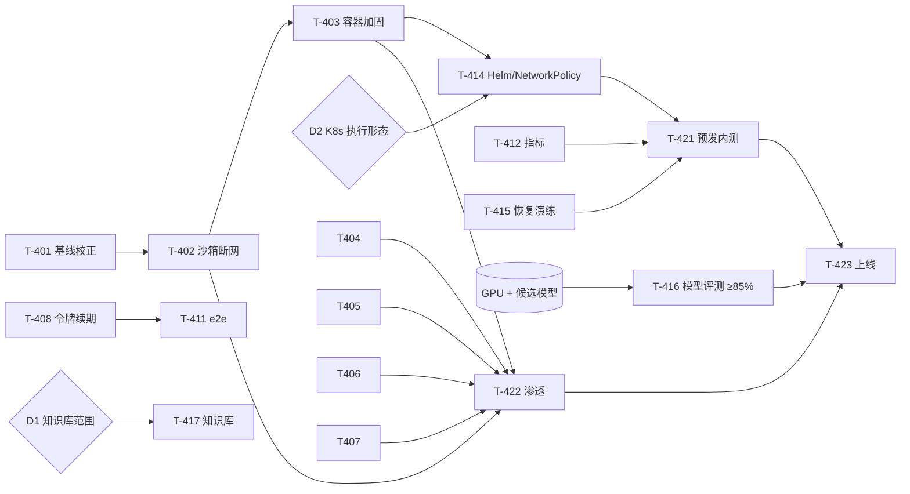

# M4 · 生产化开发计划

> 制定：2026-09-06。任务编号对应 [PRD §7 M4](PRD.md)（任务 SSOT，本文只放排期、依赖、决策与风险）。
> 起点：M0–M3 功能面已落地（~15k 行、166 测试、全生产驱动双副本实测跑通），但 2026-09 审计确认
> **尚不能上企业生产**——差距不在「功能没做」，而在安全边界、真实模型能力、日常可用性、运维成熟度四类。
> 本计划取代 [go-live-plan.md](go-live-plan.md) 的时间估算与任务粒度；其阶段划分仍有效（映射见文末）。

## 1. 目标与出口

**目标**：首个企业客户生产上线，并稳定运行 2 周无 P0 事故。

**出口标准（缺一不上）**

| 维度 | 标准 | 对应任务 |
|---|---|---|
| 安全 | 沙箱容器级断网、容器加固、上传治理、审计 DB 级不可变、主密钥可轮换、日志脱敏；第三方渗透高危清零；红队 ≥51/51 | T-402–407、T-422 |
| 可用 | 令牌静默续期（5 分钟任务不掉线）、模型重试/降级、成员管理 UI、e2e 进 CI 阻断 | T-408–411 |
| 能力 | 生产候选模型上黄金集 **≥85%**（REPEAT≥3），hard ≥60% | T-416 |
| 运维 | `/metrics` + 告警 + Grafana；备份**恢复演练**通过；Helm 双副本 + NetworkPolicy；端到端 TLS 可配 | T-412–415 |
| 流程 | 内测 2 周出口；production.md 逐项签字；回滚演练 | T-421、T-423 |
| 诚实 | PRD 勾选与代码一致（无虚标） | T-401 |

## 2. 先校正地基（T-401）

2026-09 核实发现 5 项 PRD 标「完成」但代码不符，已改回 [~] 并在 PRD 注明差距：

| 任务 | PRD 原声称 | 代码现状 | 归入 |
|---|---|---|---|
| T-202 | bge-m3 向量 + reranker | SQLite FTS5 + BM25 关键词，向量零引用 | T-417 |
| T-211 | K8s Job 执行器 | 仅 local / docker 执行器 | T-414 |
| T-303 | 评测-微调闭环 | 仅评测框架 | T-420 |
| T-209 | 策略中心、审计导出 | 用量/审计检索/留存/追踪有，其余无 | T-413 |
| T-213 | 渗透测试修复 | 红队 48/48；第三方渗透未做 | T-422 |

原则：**勾选随提交走，DoD 达成才勾**；每周五 checkpoint 更新 [STATUS.md](STATUS.md)。

## 3. 任务总览

| 编号 | 任务 | P | 估时 | 依赖 | 主责 |
|---|---|---|---|---|---|
| T-401 | 基线校正与冻结 | P0 | 0.5d | — | A |
| T-402 | 沙箱网络容器级隔离 | P0 | 3–5d | T-401 | A |
| T-403 | 容器加固补齐 | P0 | 1–2d | T-402 | A |
| T-404 | 上传治理（白名单 + ClamAV 可选） | P1 | 2–3d | — | A |
| T-405 | 审计不可变机制化 | P1 | 1–2d | — | A |
| T-406 | 主密钥轮换 | P1 | 2–3d | — | A |
| T-407 | 日志脱敏 | P1 | 1d | — | A |
| T-408 | 令牌静默续期 + SSE 重连 | P0 | 2–3d | — | B |
| T-409 | 模型调用韧性（重试/降级/熔断） | P1 | 1–2d | — | A |
| T-410 | 成员与角色管理 UI | P1 | 2d | — | B |
| T-411 | 前端自动化测试（e2e + 单测） | P0 | 2–3d | T-408 | B |
| T-412 | 指标与追踪 | P1 | 2–3d | — | A |
| T-413 | 审批规则表与策略中心 | P1 | 3–4d | — | A+B |
| T-414 | Helm 生产化 + 执行器定案（ADR-006） | P1 | 3–5d | T-403、D2 | A |
| T-415 | 加密/TLS 指引 + 恢复演练 | P1 | 2d | — | A |
| T-416 | 真实模型评测与调优 | P0 | 1–2 周 | **GPU 环境** | C |
| T-417 | 知识库升级或重定范围 | P1 | 5–8d（甲） | **D1** | C/A |
| T-418 | 多租户开关与迁移 | P2 | 2–3d | — | A |
| T-419 | 集成用服务账号 / API Key | P2 | 2d | — | A |
| T-420 | 评测-微调闭环落地 | P2 | 2–3d | T-416 | C |
| T-421 | 预发环境与内测 | — | 日历 2–3 周 | T-412、414、415、**环境** | A + 用户 |
| T-422 | 第三方渗透测试与修复 | — | 外部 1–2 周 | T-402–407 | 外部 + A |
| T-423 | M4 验收 / 生产上线 | — | — | 全部 P0、T-416、421、422 | 全体 |

角色：**A** 资深全栈（后端/安全/运维）· **B** 前端（约 50%）· **C** 模型/算法（GPU 评测；可由 A 兼任但拉长 T-416）。
工程量合计约 **45–60 人日**；P0 + P1 约 35–45 人日。

## 4. 排期（10 周，按启动日相对计）

假设 A 全职 + B 半职，GPU 环境 W3 前到位。若 9/7 启动，国庆假期（10/1–10/7）约损失 1 周，上线日随之推到 11 月中下旬。

| 周 | A（后端/安全/运维） | B（前端） | C（模型） | 检查点 |
|---|---|---|---|---|
| W1 | T-401 → T-407 → **T-402 开始** | **T-408 令牌续期** | GPU 环境筹备 | |
| W2 | T-402 收口 → T-403 → T-405 | T-408 收口 → T-411 开始 | | **CP1** 沙箱内网探测被拒 |
| W3 | T-406 → T-409 → T-404 开始 | T-411 收口 → T-410 | **T-416 第 1 轮** | **CP2** 5 分钟任务不掉线、e2e 进 CI |
| W4 | T-404 收口 → T-412 → T-415 开始 | T-410 收口 → T-413 前端 | T-416 迭代 | |
| W5 | T-415 收口 → T-413 后端 → T-414 开始 | T-413 策略中心 UI | T-416 第 2 轮 | **CP3** 模型初判 + **D1/D2 决策** |
| W6 | T-414（含 ADR-006） | 收尾 / 打磨 | T-417 甲开始（若 D1=甲） | |
| W7 | T-417 或 T-418/419；**T-421 预发搭建** | | T-417 | **T-422 渗透启动** · **CP4** 预发就绪 |
| W8 | T-421 内测 · 缺陷修复 | 内测缺陷 | T-416 收口 ≥85% | |
| W9 | T-421 内测 · T-422 修复 | | T-420 | **CP5** 内测出口 + 高危清零 |
| W10 | **T-423 灰度 → 全量** · 回滚演练 | | | **GO** |

PRD 团队基线（6–8 人）可压到 **约 6 周**——下限由「内测 2 周 + 渗透 1–2 周」决定，不是工程量。

## 5. 依赖图

## 6. 需要你提供的（按截止周）

| 截止 | 事项 | 阻塞 |
|---|---|---|
| W3 前 | GPU 机器 + 候选模型服务（vLLM：Qwen3-32B / DeepSeek-V3） | T-416 —— **整个计划最大的变量** |
| W5 | **D1** 知识库：甲（向量 + Docling，+5–8d）还是乙（关键词 v1，向量 v2） | T-417 |
| W5 | **D2** K8s 沙箱形态：原生 K8s Job 执行器 vs Docker 执行器 + 专用节点（或授权按 ADR-006 建议定） | T-414 |
| W6 | K8s 测试集群（kind/k3s 可自建；建议给真实集群） | T-414、T-421 |
| W7 | 企微 / 飞书 / 钉钉应用凭据；渗透测试供应商 + 范围授权 | T-421、T-422 |
| W8 | 10 名种子用户；真实 IdP 接入信息 | T-421 |
| W10 | 上线窗口；回滚决策人 | T-423 |

## 7. 风险与对策

| 风险 | 概率 | 对策 |
|---|---|---|
| **模型能力门不过**（现基线 40%，要 85%） | 中高 | W3 就跑、预算 2 轮迭代；CP3 若 <70% 立即触发换模型 / 混合路由（敏感任务本地、通用任务外部 API，客户自选）决策；上线日 = max(工程, 模型) |
| GPU 环境迟到 | 中 | 其余工作流不阻塞；但模型门是硬门，晚到几周上线就晚几周 |
| K8s 执行器范围膨胀 | 中 | ADR-006 限定；「Docker 执行器 + 专用沙箱节点」是可接受首版 |
| 知识库方案甲挤占 | 中 | D1 允许乙先上；甲入 v1.1 |
| 渗透返工 | 中 | W9 预留缓冲；T-402–407 先做完再启动渗透 |
| 国庆假期 | 确定 | 约 1 周，已计入 |
| 单人瓶颈 | 高（若只 A） | 至少 A + B；T-416 最好独立 C |

## 8. 与 go-live-plan.md 的映射

| go-live 阶段 | 本计划 |
|---|---|
| 阶段 0 产品有效性 | T-416 |
| 阶段 1 生产执行路径 | ✅ 已完成（2026-08-29 容器模式实测） |
| 阶段 2 预发与真实依赖 | T-414、T-415、T-421 前半 |
| 阶段 3 内测 | T-421 |
| 阶段 4 合规运营 | T-405、T-406、T-407、T-422 |

## 9. 工作方式

- 从 PRD §7 M4 按依赖顺序领任务；实现满足 **DoD** 才勾选，提交信息引用编号（如 `feat(executor): 沙箱默认断网 [T-402]`）。
- 红线不放松：**沙箱默认禁出网是容器层机制，不是命令正则**；审批规则不绕过；密钥不落明文；审计不可删是 DB 权限，不是代码约定。
- 每周五 checkpoint：更新 STATUS.md、跑全量测试 + 黄金冒烟 + 红队集；跌 5 个点阻断。
- 任何架构定案写 ADR（ADR-006 执行器形态、ADR-007 向量库选型）。
